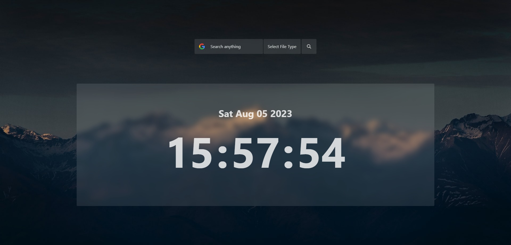

# Search App using React.js

This app allows you to search for files by file type on Google. It is made in React.js and has an auto unique background change feature. The search results are accurate and the app is easy to use.



## Tech Stack

The website is built using the following technologies:

- React.js
- Tailwind CSS

## Features

- Fully Responsive
- User Friendly Design
- Easy to use
- Search for files by file type on Google
- Auto unique background change
- Accurate search results
- Made using Tailwind CSS
- Can be set as your Chrome's default home page

## Usage

To use the this Search App, simply follow this steps :

1. Clone the repository :

```bash
   git clone https://github.com/chiragpgauswami/search-app.git
```

2. Open the project folder :

```bash
   cd search-app
```

3. Install dependencies :

```bash
   npm install
```

4. Start the development server :

```bash
   npm start
```

5. Open your web browser and visit http://localhost:3000 to see the website.

## Customization

You can customize the Search App's UI by adding or modifying the CSS styles in the Index.css file. Feel free to experiment with different colors, fonts, and layout arrangements.

## Contributing

Contributions are welcome! If you find any issues or want to add new features, please open an issue or submit a pull request.

## Author

This project was created by Chirag P. Gauswami.

## License

This project is Open Source you can use it.

## Links

- [Source Code](https://github.com/chiragpgauswami/search-app)
- [Demo](https://chiragpgauswami.github.io/search-app)
